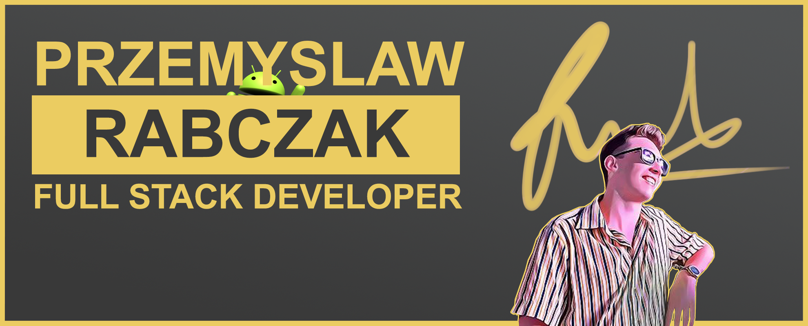

# Hi everyone, I'm Przemyslaw - call me Przemek 👋 

## I'm a Computer Science Student! 👨‍💻

  

  

### Passions:
- 🤖 Game and Software Development!
- ✒️ Graphic Design
- ⚒️ 3D Modelling
- ⚖️ Investing
- ☁️ Full Stack Cloud Dev 

### About me:
- 🥅 2022 Goals: Get internship, Learn more about web3, develop 2D game, Make website about me 
- 🌱 I’m currently learning everything
- 👯 I’m looking to collaborate with other content creators
- ⚡ Fun fact: I love to make games more than playing them!
- 🐶 I love animals!

### Connect with me:

<a href="https://twitter.com/AwRabczak">

<a href="https://www.linkedin.com/in/przemyslaw-rabczak-8039a51b6/">
&nbsp;&nbsp;
<a href="https://www.instagram.com/przemorab/?hl=en">

### Languages and Tools:

 
 

---

[twitter]: https://twitter.com/AwRabczak
[linkedin]: https://www.linkedin.com/in/przemyslaw-rabczak-8039a51b6/
